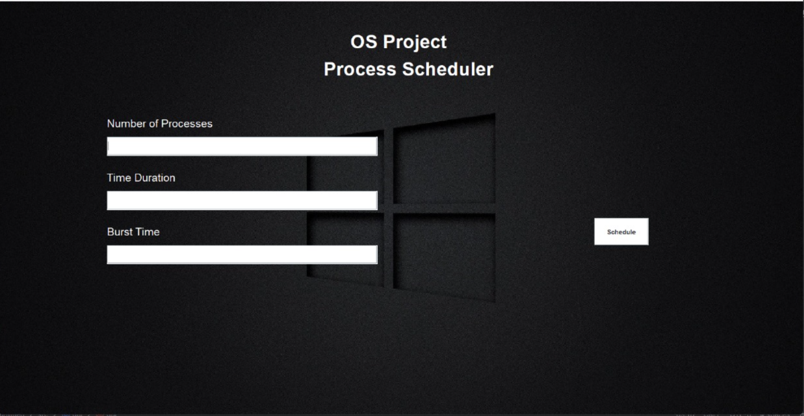
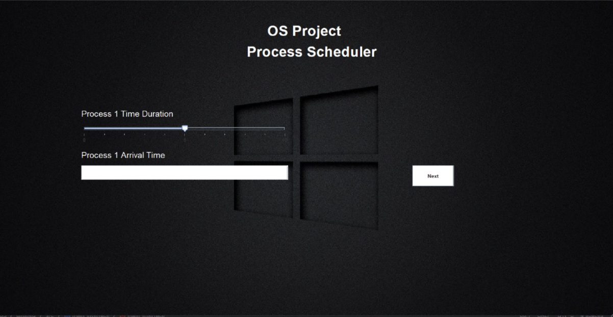
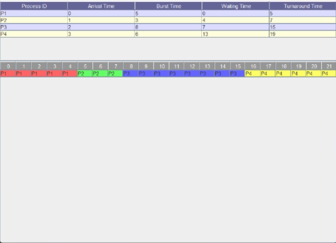

# Comprehensive OS Scheduler & Disk Simulator

A Java Swing desktop application that simulates classic **Operating System CPU scheduling algorithms**, **real-time scheduling algorithms**, and **disk scheduling algorithms**, with live visualizations (Gantt charts, progress bars, and XY line charts).




---

## Table of Contents

- [Overview](#overview)
- [Features](#features)
- [Algorithms Implemented](#algorithms-implemented)
- [Architecture](#architecture)
- [File-by-File Breakdown](#file-by-file-breakdown)
- [Application Flow](#application-flow)
- [Getting Started](#getting-started)
- [Known Issues & Limitations](#known-issues--limitations)
- [Possible Improvements](#possible-improvements)

---

## Overview

The project provides an interactive GUI (built with **Java Swing**) that lets a user:

1. Choose a scheduling category — **Normal (CPU) Scheduling**, **Real-Time Scheduling**, or **Disk Scheduling**.
2. Enter the number of processes/requests and their attributes (arrival time, burst time, priority, period, etc.).
3. Run the selected algorithm and visualize the result as:
   - A sortable results **table** (Process ID, Waiting Time, Turnaround Time, etc.) plus a colored **Gantt chart table**.
   - Live **progress bars** per process that fill up in real time as each process "executes" (via `SwingWorker` + `Thread.sleep`, one tick per simulated time unit).
   - For disk scheduling, a live-updating **XY line chart** (via JFreeChart) showing disk head movement across cylinders.

The simulation logic runs off the Swing Event Dispatch Thread using `SwingWorker`, so the UI remains responsive while the animation plays out.

---

## Features

- **CPU Scheduling** (non real-time): FCFS, SJF, Priority, Round Robin
- **Real-Time Scheduling**: Rate Monotonic Scheduling (RMS), Earliest Deadline First (EDF)
- **Disk Scheduling**: FCFS, SSTF, SCAN, C-SCAN, LOOK, C-LOOK (algorithm selector wired up; see [Known Issues](#known-issues--limitations) for simulation accuracy notes)
- Dynamic, per-process input forms that adapt their fields based on the selected algorithm (e.g., Round Robin doesn't ask for arrival time input, Priority/EDF/RMS ask for an extra numeric field)
- Two visualization modes for CPU/real-time results:
  - **Table view** — final computed metrics + a cell-colored Gantt chart (`Table.java`, `Execution.java`)
  - **Progress Bar view** — animated, real-time execution simulation (`ProgressBar.java`)
- Randomized disk-request generation with a live animated chart of head movement (`DiskSchedulingSimulation.java`)
- Background-thread execution via `SwingWorker` so the Swing UI thread never blocks during animated runs

---

## Algorithms Implemented

### CPU Scheduling (non-preemptive, single core)
| Algorithm | Description | Where computed |
|---|---|---|
| **FCFS** (First-Come, First-Served) | Processes run in order of arrival time | `Table.java`, `ProgressBar.java` |
| **SJF** (Shortest Job First) | Processes sorted and run by ascending burst time | `Table.java`, `ProgressBar.java` |
| **Priority** | Processes sorted by arrival time then priority | `Table.java`, `ProgressBar.java` |
| **Round Robin** | Fixed time quantum (`qt = 3`) cyclic execution with remaining-time bookkeeping | `Table.java`, `ProgressBar.java` |

### Real-Time Scheduling
| Algorithm | Description | Where computed |
|---|---|---|
| **RMS** (Rate Monotonic Scheduling) | Processes sorted by ascending period; shorter-period tasks get higher priority | `Execution.java` |
| **EDF** (Earliest Deadline First) | Processes sorted by ascending absolute deadline (`arrivalTime + period`) each cycle | `Execution.java` |

Both are simulated as periodic tasks: after a process finishes its burst, `RealTimeProcess.reset()` advances its `deadline`/`nextStartTime` by one `period` and refills `remainingTime`.

### Disk Scheduling
| Algorithm | Description |
|---|---|
| **FCFS** | Requests serviced in the (shuffled/random) order they arrive |
| **SSTF** (Shortest Seek Time First) | Requests sorted by absolute distance from the current head position |
| **SCAN** | Requests sorted ascending; head sweeps and reverses direction at the disk boundary |
| **C-SCAN** | Circular SCAN variant (same sort, direction-reset logic simplified — see limitations) |
| **LOOK / C-LOOK** | Same sorted ordering as SCAN/C-SCAN in the current implementation |

Requests are randomly generated (20 requests, cylinder range `0–199`, starting head position `100`) each time the algorithm dropdown changes, and the head movement is animated on a `javax.swing.Timer` (500 ms/tick) using a JFreeChart `XYSeriesCollection`.


---

## Architecture

The project has **no build tool** (no Maven/Gradle) and **no package declarations** — every class lives in the default package as a set of loose `.java` files meant to be compiled and run directly with `javac`/`java`.

There is **no single unified entry point** used consistently: `Main.java` is the intended top-level launcher, but several classes (`Scheduler`, `RT_Scheduler`, `DiskSchedulingSimulation`, `ProgressBar`, `Execution`, `PriorityGui`, `main_interface`) each also carry their own `public static void main` for standalone testing/demo purposes.

High-level flow for CPU/Real-Time scheduling:

```
Main (mode selector: Normal / Real-Time / Disk)
 ├─ Normal Schedule  → Scheduler (pick algorithm + process count)
 │                        → main_interface (collect per-process input)
 │                             → Console (choose Table or Progress Bar view)
 │                                  ├─ Table (static results + Gantt table)
 │                                  └─ ProgressBar (animated per-process bars)
 │
 ├─ Real-Time Schedule → RT_Scheduler (pick RMS/EDF + process count)
 │                          → main_interface (collect per-process input)
 │                               → Console (RealTimeProcess overload)
 │                                    └─ Execution (Gantt table, animated via SwingWorker)
 │
 └─ Disk Schedule → DiskSchedulingSimulation (self-contained: dropdown + live chart)
```

`main_interface` is shared by both the normal and real-time flows; it branches its field layout and the `Process`/`RealTimeProcess` object it constructs based on the `selectedItem` algorithm string passed in from `Scheduler`/`RT_Scheduler`.

---

## File-by-File Breakdown

| File | Role |
|---|---|
| **Main.java** | Top-level landing window. Lets the user pick "Normal Schedule", "Real_Time Schedule", or "Disk Schedule" and launches the corresponding flow. |
| **Scheduler.java** | CPU-scheduling setup screen: slider for process count + dropdown for algorithm (FCFS/SJF/Priority/Round Robin). Launches `main_interface`. |
| **RT_Scheduler.java** | Real-time scheduling setup screen: slider for process count + dropdown for algorithm (RMS/EDF). Launches `main_interface`. |
| **main_interface.java** | Contains the `Process` domain class and the multi-step form that collects per-process attributes (duration, arrival time, priority/period) one process at a time, adapting its fields to the chosen algorithm. Builds a `List<Process>` or `List<RealTimeProcess>` and hands off to `Console`. |
| **Console.java** | Intermediate screen offering "Table" or "Progress Bar" visualization; has two constructor overloads — one for `List<Process>` (CPU scheduling) and one for `List<RealTimeProcess>` (real-time scheduling). |
| **Table.java** | Computes final scheduling metrics (waiting time, turnaround time, start/completion time) for FCFS/SJF/Priority/Round Robin and renders them in a `JTable`, plus a colored per-time-unit Gantt chart `JTable`. |
| **ProgressBar.java** | Animates CPU scheduling in real time: a `JProgressBar` per process filled tick-by-tick on a background `SwingWorker` thread according to the selected algorithm (Round Robin/FCFS/SJF/Priority). |
| **Execution.java** | Contains the `RealTimeProcess` domain class. Renders a process-attributes table and a colored Gantt-chart table for RMS/EDF, driven by a `SwingWorker` that simulates periodic task execution second-by-second. |
| **DiskSchedulingSimulation.java** | Fully self-contained disk-scheduling demo: generates random disk requests, lets the user pick FCFS/SSTF/SCAN/C-SCAN/LOOK/C-LOOK from a dropdown, and animates head movement on a JFreeChart `XYSeriesCollection` via a `javax.swing.Timer`. |
| **RT_Scheduler.java** | (see above) |
| **PriorityGui.java** | Standalone/legacy multi-step input form for a priority-only workflow. Not wired into `Main`'s navigation flow — appears to be an earlier iteration superseded by `main_interface`. |
| **RealTimeSchedulingGUI.java** | Empty placeholder class (`public class RealTimeSchedulingGUI {}`) — no functionality, unused. |
| **Task.java** | A `Runnable` task model (name, period, execution time, deadline) intended for use with `ScheduledFuture`/`ScheduledExecutorService`-style periodic scheduling. Not currently referenced by any other class. |
| **MIPS_ISA.java** | Unrelated scratch file — a tiny stub sketching a MIPS instruction-decode field set (`RegDst`, `ALuOp`, etc.) with a one-line `main`. Not part of the OS scheduler/disk simulator functionality. |
| **os_background.jpeg** | Background image used by most screens. |
| **ProgressBar.png, schedule.png, table.png, textfield_color.png** | Screenshots/reference images of the running application. |

---

## Application Flow

### 1. CPU Scheduling (Normal Schedule)
1. `Main` → select "Normal Schedule" → `Scheduler`
2. `Scheduler` → set process count (slider 0–10) + algorithm (FCFS/SJF/Priority/Round Robin) → `main_interface`
3. `main_interface` → step through one form per process, collecting time duration, arrival time, and priority as applicable → `Console`
4. `Console` → choose "Table" (static Gantt + metrics) or "Progress Bar" (live animation)

### 2. Real-Time Scheduling
1. `Main` → select "Real_Time Schedule" → `RT_Scheduler`
2. `RT_Scheduler` → set process count + algorithm (RMS/EDF) → `main_interface`
3. `main_interface` → step through one form per process, collecting duration, arrival time, and period → `Console` (real-time overload)
4. `Console` → "Table" launches `Execution` (animated Gantt table); "Progress Bar" is present in the UI but not wired to an action in this flow.

### 3. Disk Scheduling
1. `Main` → select "Disk Schedule" → `DiskSchedulingSimulation` opens directly with a live chart and algorithm dropdown (no separate input step — requests are randomly generated).

---



## Getting Started

### Prerequisites
- **JDK 8+** (uses `javax.swing`, standard library only, except for disk scheduling)
- **JFreeChart** library (required only for `DiskSchedulingSimulation.java`) — download the JAR (e.g. `jfreechart-1.5.x.jar`, which also needs `jcommon`) and add it to your classpath.

### Compiling & Running

> There is no Maven/Gradle build file — compile the sources directly.

From the project root, using PowerShell:

```powershell
# Compile everything (JFreeChart jar only needed if you plan to run the disk simulator)
javac -cp ".;jfreechart-1.5.x.jar;jcommon-1.0.x.jar" *.java

# Run the full app starting from the main menu
java -cp ".;jfreechart-1.5.x.jar;jcommon-1.0.x.jar" Main

# Or run an individual module directly, e.g.:
java -cp ".;jfreechart-1.5.x.jar;jcommon-1.0.x.jar" DiskSchedulingSimulation
java -cp "." Scheduler
java -cp "." RT_Scheduler
```

### ⚠️ Before running: fix the hardcoded image path

Every screen loads its background image from an absolute, machine-specific path:

```java
I1 = new ImageIcon("E:\\Documents\\4th semester\\OS\\untitled\\src\\gui\\os_background.jpeg");
```

This path exists only on the original author's machine and **will not resolve on any other computer**. Before running, either:
- Recreate that exact directory structure and drop `os_background.jpeg` there, **or**
- Update each occurrence (in `Main.java`, `Scheduler.java`, `RT_Scheduler.java`, `main_interface.java`, `PriorityGui.java`, `Console.java`, `Table.java`) to a relative path such as `"os_background.jpeg"` (the file already ships at the project root).

An `ImageIcon` pointed at a missing file won't throw — the label will simply render blank — so the app will still run, just without the background artwork, if you skip this step.

---

## Known Issues & Limitations

- **Hardcoded absolute file paths** to `os_background.jpeg` scattered across nearly every GUI class (see above).
- **No build tooling** — no `pom.xml`/`build.gradle`; JFreeChart must be added to the classpath manually.
- **No packages** — all classes sit in the default package, so filenames must stay unique and the whole project must be compiled/run from one directory.
- **Dead/unused code**:
  - `RealTimeSchedulingGUI.java` is an empty stub.
  - `PriorityGui.java` appears to be an earlier, superseded version of `main_interface.java`'s priority flow — it's not reachable from `Main`.
  - `Task.java` (a `Runnable`-based periodic task model) is not referenced anywhere else in the codebase.
  - `MIPS_ISA.java` is unrelated scratch code (a MIPS instruction-decoding stub) with no connection to the scheduler/disk simulator.
  - In `Console.java`'s real-time constructor, the "Progress Bar" button's `ActionListener` body is entirely commented out — clicking it does nothing.
- **Disk scheduling correctness**: `C-SCAN`, `LOOK`, and `C-LOOK` currently share the same sort/service order as `SCAN` in `generateRequestsAndStart` — `handleMovingDirection()` only toggles a `movingUpward` flag that isn't actually used to reorder or wrap the request queue, so the four "directional" algorithms are not yet behaviorally distinct from one another.
- **String comparisons use `==` instead of `.equals()`** in several places (e.g. `main_interface.java`, `Table.java` — `selectedItem=="FCFS"`), which works today only because `JComboBox` returns interned string literals from the same array; it's fragile and not idiomatic Java.
- **Round Robin quantum is hardcoded** (`qt = 3`) in both `Table.java` and `ProgressBar.java` rather than being user-configurable.
- **`Execution.java`'s Gantt table caps at 90 time units** (`new String[90]`) — longer-running real-time simulations will throw an `ArrayIndexOutOfBoundsException` once `currentTime` exceeds that.
- **No input validation** on the text fields (`Integer.parseInt` on raw user input) — non-numeric input will throw an unhandled `NumberFormatException`.
- **Simulations run indefinitely**: `Execution.java`'s RMS/EDF loops (`while (true)`) never terminate on their own; the window must be closed manually.

---

## Possible Improvements

- Migrate to a Maven/Gradle project with JFreeChart declared as a managed dependency.
- Replace hardcoded absolute image paths with classpath-relative resource loading (`getClass().getResource(...)`).
- Implement true SCAN/C-SCAN/LOOK/C-LOOK direction-aware request ordering (elevator algorithm) instead of a static sort.
- Replace `==` string comparisons with `.equals()`/an `enum` for algorithm selection.
- Add input validation and user-facing error dialogs instead of letting exceptions propagate.
- Make the Round Robin time quantum and disk simulation constants (`MAX_CYLINDER`, `REQUEST_COUNT`, `HEAD_POSITION`) user-configurable from the UI.
- Remove or finish the dead code (`RealTimeSchedulingGUI`, `PriorityGui`, `Task`, `MIPS_ISA`) to keep the codebase focused on the scheduler/disk-simulator scope.
- Add automated unit tests for the scheduling algorithms' metric calculations (waiting time, turnaround time, deadline misses).
